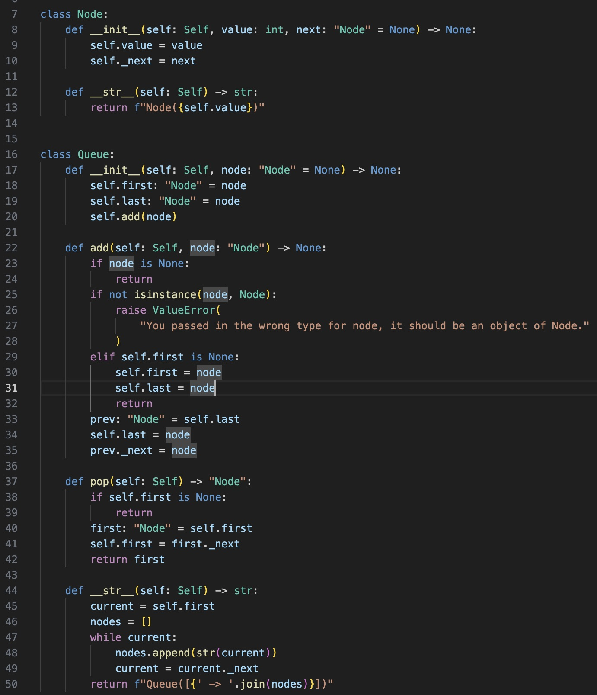
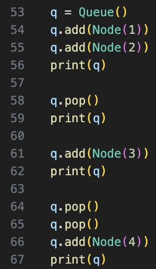
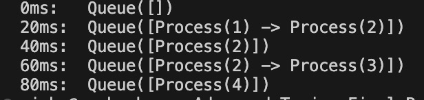

<!--
_class: centered
backgroundImage: "linear-gradient(to right, #669bbc, #003049)"
color: #fdf0d5
-->

# Advanced Topics Final Presentation

## By: Vishwesswaran Gopal

---

<!--
backgroundImage: "linear-gradient(to right, #003049, #669bbc)"
-->

# Introduction

- ##### [Fundamentals of Operating Systems](https://pages.cs.wisc.edu/~remzi/OSTEP/)
- ##### Course Content
  - ###### Virtualization
  - ###### Concurrency
  - ###### Persistence
  - ###### Security
- ##### Course Goals: To understand how operating systems work.
- ##### **_No_** certification

---

<!--
_class: centered
backgroundImage: "linear-gradient(to right, #669bbc, #003049)"
-->

# Key Concepts

---

<!--
backgroundImage: "linear-gradient(to right, #003049, #669bbc)"
-->

# CPU Scheduling

- #### How can multiple processes (running programs) seemingly run on a single CPU, which can only perform one task at a time?
- #### _FIFO_ (First In, First Out)
  - ##### Strengths
  - ##### Weaknesses

---

<!--
class: centered
backgroundImage: "linear-gradient(to right, #669bbc, #003049)"
-->

# Virtualization of Memory

- #### How is physical memory split amongst many processes?
- #### _Base & Bounds_
  - ##### Strengths
  - ##### Weaknesses

---

<!--
backgroundImage: "linear-gradient(to right, #003049, #669bbc)"
-->

# Code for FIFO Scheduler

---

<!--
backgroundImage: "linear-gradient(to right, #669bbc, #003049)"
-->

# Implementation Code

---

<!--
backgroundImage: "linear-gradient(to right, #003049, #669bbc)"
-->

# Testing Code

---

<!--
backgroundImage: "linear-gradient(to right, #669bbc, #003049)"
-->

# Terminal Output

---

<!--
_class: centered end
backgroundImage: "linear-gradient(to right, #003049, #669bbc)"
-->

# The End!
